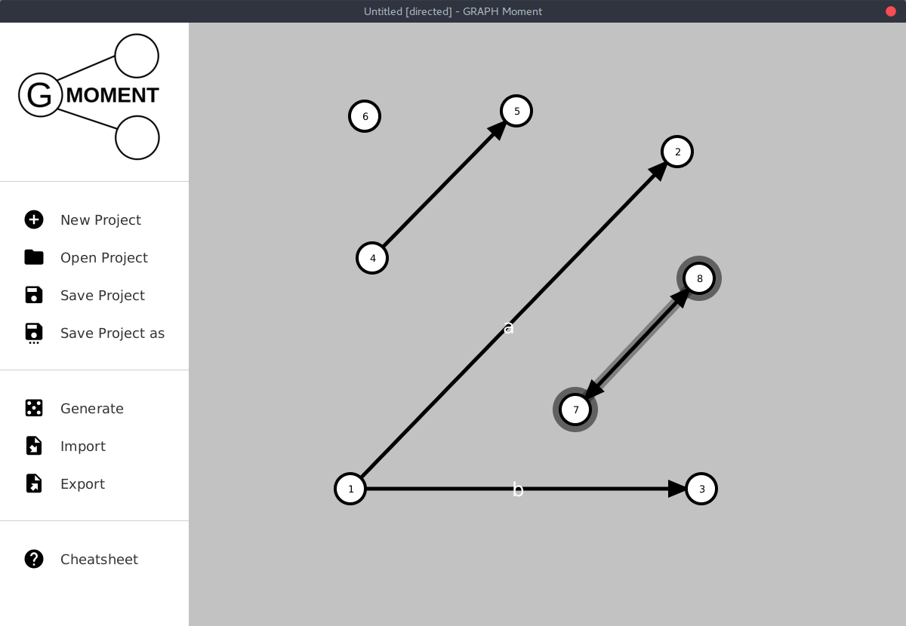

# GRAPH-moment


## About
GRAPH-moment is a desktop app providing an easy way to create graphs visual representations in just a moment. 

### Features
- Generating random graphs of various types and sizes.
- Importing from / exporting to edge list and adjacency matrix.
- Choosing between directed / undirected graphs.
- Labeling edges.
## Release

## Building
1. Clone the repo.
    ```
    git clone https://github.com/mtdrewski/GRAPH-moment
    ```
2. Build with gradle.
    ```
    ./gradlew runShadow
    ```
## Frameworks
GRAPH-moment uses following frameworks:
- [JavaFX](https://openjfx.io/)
- [JFoenix](http://www.jfoenix.com/)
- [fontawesomefx](https://bitbucket.org/Jerady/fontawesomefx/src/master/)
